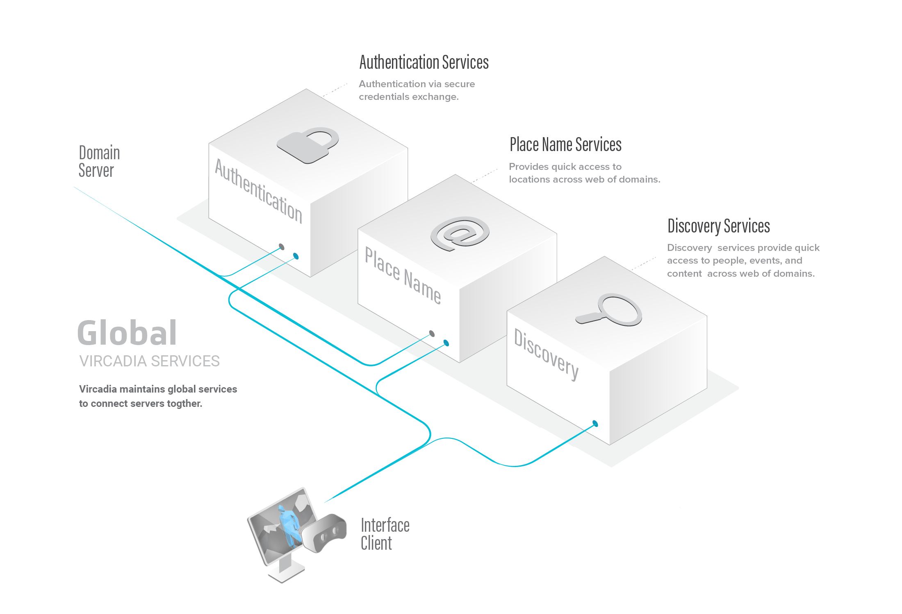

# Introduction

The Vircadia open source metaverse ecosystem is comprised of many components. [Understand the Architecture](#understand-the-architecture)

## Ecosystem

* [Clients](interfaces/README.md)
  * [Web Interface](interfaces/web/README.md) (All platforms)
  * [Native Interface](interfaces/native/README.md) (Windows, Linux, MacOS)
* [Domain Server](domain-server/README.md) (Windows, Linux)
* [Metaverse Server](metaverse-server/README.md) (Windows, Linux)
  * Dashboard (...)
* [SDKs](sdks/README.md)
  * [Web](sdks/web/README.md)
* [Tools](tools/README.md)
  * [Vircadia Builder](tools/vircadia-builder/README.md) (Linux)

## Release Cycle

Vircadia's primary components are released in the following order:

1. A branch and tag are created to signify the release.
2. Release candidate builds are created from this branch and shared.
    1. If any revisions are needed, they are merged into the release branch.
    2. New release candidate builds are generated from the release branch.
3. After testing completes with high enough confidence, the release build is generated from the release branch and shared.
4. The release branch is merged into master if there were any revisions made. The branch does not get deleted afterwards.

Components that are early in their development cycle are updated instantly and independently, usually with little testing. This is to allow for quick and agile development.

:::tip Note

Component versions follow [semantic versioning](https://semver.org/) guidelines.

:::

## Understand the Architecture

...
Vircadia's architecture shows how different parts of the system work
together to give you the best VR experience.

###### On this page: ######
- [Understand the Architecture](#understand-the-architecture)
  - [Architecture Overview](#architecture-overview)
  - [Domain Server](#domain-server)
  - [Global Services](#global-services)

## Architecture Overview

Vircadia's architecture shows how different parts of the system work
together to give you the best VR experience.

###### On this page: ######
- [Understand the Architecture](#understand-the-architecture)
  - [Architecture Overview](#architecture-overview)
  - [Domain Server](#domain-server)
  - [Global Services](#global-services)

## Architecture Overview

Vircadia's architecture consists of the following components that work
together and send data to each other for your VR experience.

-   The [Vircadia Interface](#vircadia-interface) runs your personal
    experience in the metaverse. With it, you can
    `visit VR worlds <../travel>`,
    `meet people <../socialize>`, [attend
    live events](../socialize.html#attend-live-events) and more.
-   The [Domain Server](#domain-server) is the server that hosts a
    domain. The domain server hosts the content in the domain, and
    manages the
    `domain-wide settings <../../host/configure-settings>`{.interpreted-text
    role="doc"}, such as audio spatialization, user permissions, and
    running scripts.
-   The [Global Services](#global-services) connect all of the servers
    together. An instance of these services are maintained by Vircadia
    so that you can sign in and move seamlessly between places.

## Vircadia Interface

The Vircadia Interface (or simply 'Interface') is the main user
interface for Vircadia. It is used to explore the metaverse and engage
with people from around the world. When you enter a domain, your
Interface connects with the [domain server](#domain-server) that is
hosting the virtual world, alongside any [global
services](#global-services).

You can download and use the Interface on your computer or your Android
phone using the [Client-Only
Installer](install.html#client-only-installer).

### Physics Engine

Your VR experience won't be realistic without some physics. Vircadia
includes a [physics engine](http://bulletphysics.org) that simulates
behaviors of objects according to the Newtonian laws of physics. When an
object falls to the ground and bounces, or when two or more objects
collide, their movements are computed by the physics engine.

Each Interface runs its own physics engine, and the entity server
coordinates the results to produce a consistent simulation across the
entire domain.

## Domain Server

A domain is a spatial simulation in Vircadia that you can visit. It is
computed by a stack of programs on one or more computers. You need a
domain's
`place name <../../host/configure-settings/place-setting>` to visit a domain, just like you would need a web address to
visit a website.

You can
`set up your own domain <../../host/server-setup>` and host it on your local machine or on a cloud server to
make it available to other users. Your domain\'s server stack is a set
of components that simulate and manage different aspects of the domain
such as audio, entities, and avatars. Everything that you see, hear, and
do in your domain is managed by the server stack.

### Server Stack

The Domain server is at the top of this stack and its job is to give out
assignments to the other components. These components are called
Assignment Clients, because from the perspective of the domain server,
they are clients that take on different roles.

The server stack is not only controlling, managing and computing your
domain as you see it, but also how it is seen by anyone visiting your
domain. This means that the domain server hands out simulation
assignments and provides their IP addresses to connecting Interface
clients. The domain server is a single executable that spawns assignment
clients that become the different mixers as requested. Each assignment
client can function as one of the six types mentioned. The domain server
determines which assignment client functions as which mixer.

### Assignment Clients

Assignment clients control and manage various aspects of a domain. They
also communicate directly with the Interface clients connected to a
domain. There are six types of assignment clients:

  ------------------------------------------------------------------------
  Assignment   Description
  Client       
  ------------ -----------------------------------------------------------
  Avatar Mixer This mixer is in charge of your virtual presence in any
               domain. It keeps track of where you are, which avatar
               you're wearing, and how you move around the domain. For
               example, it tracks how you move your head while wearing a
               Head Mounted Display (HMD).

  Audio Mixer  Mixes all sounds, whether it's voice or environmental. And
               it does this not just for avatars, but also for all the
               entities in a domain. The Audio mixer can customize a
               stereo mix for you based on your position relative to the
               audio source.

  Entity       Tracks all entities and their properties in a domain, from
  Server       their description and position, to any behaviors attached
               to them in a script. If an entity is modified, the change
               is communicated to the entity server, which in turn relays
               the information to all clients currently visiting the
               domain.

  Asset Server Provides copies of the models, audio files, scripts, and
               other media used by the domain. It functions like a Web
               server, but using protocols tuned to Vircadia's
               architecture.

  Agent        Executes user-written JavaScript programs. If you\'ve
               written a script to get your avatar to clap, or create a
               bowling alley, the Agent will execute it. It can see
               entities, avatars, and send audio.

  Messages     Provides communication between scripts running in different
  Mixer        programs connected to the domain, which could be Interfaces
               or Agents.
  ------------------------------------------------------------------------

:::note

Sandbox manages all these components on the domain server, five
dedicated assignment clients, and as many agent assignments clients as
needed. However, it is possible to spread the assignment clients over
multiple computers, and even to divide each function among a hierarchy
of assignment components, which may be on different computers. For
instance, multiple audio mixers could be used to mix the audio in
different geographic regions of the domain.
:::

## Global Services

Vircadia maintains global services to connect different servers
together.

## License

All of Vircadia's primary components are released under an [Apache 2.0](https://www.apache.org/licenses/LICENSE-2.0) or compatible license.

However, tools, supporting components, and third party projects that are not vital to the normal operation of the ecosystem may be distributed under a different license.
